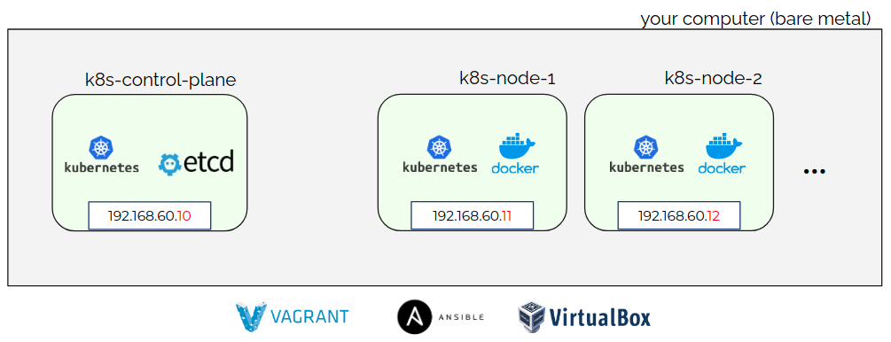

# kubernetes-demo

## 1. Requirements

Download vagrant and virtualbox: https://www.vagrantup.com/downloads

8GB of RAM and a processor with 4+ cores is recommended.

## 2. Provision a full-fledged Kubernetes cluster in your machine

We will use Vagrant to provision VMs that form a Kubernetes cluster, as illustrated below:



Go to the `cluster/` directory, and:

1. Run `vagrant up` to create VMs
2. Run `vagrant halt` or `vagrant up` to turn off and on VMs after creation
3. Run `vagrant ssh VM-NAME` to run commands inside of a VM

With the cluster running, generate a token for external access.

Run:

```bash
# create service account
vagrant ssh control-plane -- kubectl -n kube-system create serviceaccount kubeconfig-sa

# create cluster-role binding
vagrant ssh control-plane -- kubectl create clusterrolebinding add-on-cluster-admin --clusterrole=cluster-admin --serviceaccount=kube-system:kubeconfig-sa
```

Get token with:

```bash
TOKENNAME=`vagrant ssh control-plane -- kubectl -n kube-system get serviceaccount/kubeconfig-sa -o jsonpath='{.secrets[0].name}'`

TOKEN=`vagrant ssh control-plane -- kubectl -n kube-system get secret $TOKENNAME -o jsonpath='{.data.token}'| base64 --decode`

CLUSTER_CA=`vagrant ssh control-plane -- kubectl config view --raw -o=go-template='{{range .clusters}}{{if eq .name "kubernetes"}}"{{with index .cluster "certificate-authority-data" }}{{.}}{{end}}"{{ end }}{{ end }}'`
```

Create a kubeconfig file:

Install kubectl:

```bash
curl -LO "https://dl.k8s.io/release/$(curl -L -s https://dl.k8s.io/release/stable.txt)/bin/linux/amd64/kubectl"
sudo install -o root -g root -m 0755 kubectl /usr/local/bin/kubectl
rm ./kubectl
```

```bash
kubectl config --kubeconfig=config-demo set-cluster demo --server=https://localhost:8008

kubectl config set-credentials kubeconfig-sa --token=$TOKEN


```

## 3. Build applications containers

This demo contains one application composed of 2 services:

- **Time backend:** a time server which returns the current time.
- **Time frontend:** a web page which exhibits current time fetched from the backend.

Next sections will guide you through the build and execution of both containerized services.

## 3.1. Build docker images

To build the backend docker image, run:

```bash
cd src/python/backend
docker build -t jrac/time-backend:v1 .
cd -
```

To build the frontend docker image, run:

```bash
cd src/python/frontend
docker build -t jrac/time-frontend:v1 .
cd -
```

## 3.2. Run docker images

To start the **backend**, run:

```bash
docker run -d --rm --name backend -p 5001:5000 jrac/time-backend:v1
```

To start the **frontend**, run:

```bash
docker run -d --rm --name frontend --env TIME_SERVER=172.17.0.2:5000 -p 5000:5000 jrac/time-frontend:v1
```

Note that the frontend can be accessed via port 5000 of your host.
Type `http://localhost:5000` in your browser and you'll see the web page.

## 4. Run services in the Kubernetes cluster

Now let's use Kubernetes to orchestrate the deployment of our application composed of 2 services.

Time Backend was implemented as a Kubernetes Deployment with 3 replicas of a time server, plus a Kubernetes Service so it gets exposed to other services inside our cluster.

Time Frontend was implemented as a Kubernetes Pod that runs a web server, plus a Kubernetes Service that exposed it to outside the cluster.

### 4.1. Deploy the backend

kubectl apply -f <https://raw.githubusercontent.com/jeffcav/kubernetes-demo/main/src/k8s/backend/pod.yaml>

kubectl apply -f <https://raw.githubusercontent.com/jeffcav/kubernetes-demo/main/src/k8s/backend/service.yaml>

### 4.2. Deploy the frontend

kubectl apply -f <https://raw.githubusercontent.com/jeffcav/kubernetes-demo/main/src/k8s/frontend/configmap.yaml>

kubectl apply -f <https://raw.githubusercontent.com/jeffcav/kubernetes-demo/main/src/k8s/frontend/deployment.yaml>

kubectl apply -f <https://raw.githubusercontent.com/jeffcav/kubernetes-demo/main/src/k8s/frontend/service.yaml>

## 5. Access application from your host

Now that all components of our application are running, we can HTTP GET port 30001 of any node that composes our cluster (192.168.60.10 and 192.168.60.11).

From a web browser in your computer, enter: `192.168.60.11:30001` and Voilà.
